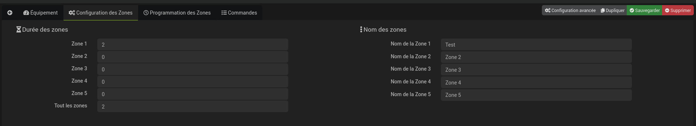

# Vérification pour le bon fonctionnement du plugin et du contrôleur RainBird
- Le module WiFi RainBird ne doit pas être sur le **Channel 13** de votre wifi.
- Définissez une adresse IP statique pour votre contrôleur **RainBird** via votre Box / Routeur
- L'utilisation de l'application RainBird via le mobile en cours d'exécution peut entraîner des problèmes de connectivité

# Plugin RainBird

Plugin qui permet de gerer votre irrigation avec la solution Rainbird avec Jeedom systeme de domotique.

Il vous faut à tout prit le **WIFI Link** : https://wifi.rainbird.com/

# Configuration du plugin

Après avoir activé le plugin, vérifier que les dépendences sont ok, si c'est pas le cas les installer.

Puis créer votre objet avec l'adresse **IP** et le **Mot de passe** et sauvegarder.

Nombre de Zone récupérer par une fonction de **l'API**

# Informations

- No Serial : si c'est un **ESP-RZXE** ça sera = 0

# Configuration des zones

Rendez-vous sur l'onglet **Configuration des zones** pour saisir la durée pour chaque zone et le nom si besoin.

# Configuration des zones lier au plugin Agenda

Si le plugin **Agenda**, est activé sinon on n'a pas l'onglet **Programmation des Zones** 

Cliquer sur **plugin Agenda** pour pouvoir saisir l'agenda en lien avec la zone à arroser

Après avoir créer l'agenda voici un exemple ci-dessous :

